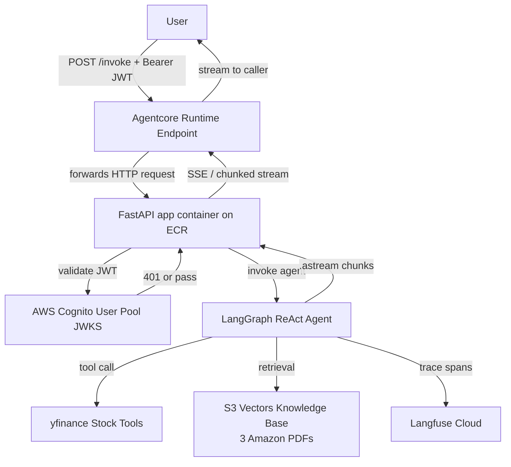

# Design Document: aws-stock-agent

## Overview

The aws-stock-agent is a streaming AI agent API hosted on AWS Agentcore Runtime. Authenticated users send natural-language stock queries to a FastAPI `/invoke` endpoint. A LangGraph ReAct agent orchestrates reasoning over two yfinance-backed stock tools and a knowledge base of Amazon financial PDFs, streaming partial results back via SSE or chunked transfer encoding. All agent executions are traced in Langfuse (non-blocking). Infrastructure is fully provisioned with Terraform.

### Key Design Decisions

- **LangGraph ReAct** over a custom loop: provides built-in iteration guards, tool-call routing, and `.astream()` support out of the box.
- **AWS Agentcore Runtime** as the hosting layer: the FastAPI app is packaged as a Docker container, pushed to Amazon ECR, and registered with Agentcore Runtime. Agentcore manages the container lifecycle, scaling, and IAM-native invocation — no ECS/EKS cluster to operate.
- **Claude Haiku 4.5 via Amazon Bedrock** (`anthropic.claude-haiku-4-5`) as the LLM powering the ReAct agent's `reason` node. Invoked through `langchain-aws` (`ChatBedrock`) so LangGraph tool-calling and streaming work natively.
- **Cognito JWT validation in FastAPI middleware**: keeps auth logic centralized and decoupled from agent logic. Agentcore Runtime does not handle auth natively; the middleware owns it.
- **Langfuse callbacks** (non-blocking): observability failures must never degrade user experience.
- **Terraform modules** per concern (auth, runtime, IAM, ECR): enables independent lifecycle management and reuse.

---

## Architecture



### Agentcore Runtime Deployment Model

The FastAPI application is deployed to Agentcore Runtime as a container:

1. **Docker image** — built from `backend/Dockerfile`, based on `python:3.11-slim`. Uvicorn serves the FastAPI app on port `8080` (Agentcore's expected port).
2. **Amazon ECR** — the image is pushed to a private ECR repository provisioned by Terraform.
3. **Agentcore Runtime resource** — a `aws_bedrock_agentcore_runtime` Terraform resource (or equivalent AWS CLI/SDK call if the provider resource is not yet GA) references the ECR image URI and attaches an execution IAM role.
4. **Environment variables** — Agentcore Runtime injects env vars (`COGNITO_REGION`, `COGNITO_USER_POOL_ID`, `COGNITO_APP_CLIENT_ID`, `KB_S3_VECTORS_BUCKET`, `LANGFUSE_*`, `MAX_ITERATIONS`, LLM API key) into the container at runtime.
5. **Invocation** — Agentcore exposes a managed HTTPS endpoint. Callers hit this endpoint directly; Agentcore forwards the request to the running container.

### Request Lifecycle

1. User sends `POST /invoke` with `Authorization: Bearer <jwt>` and `{"query": "..."}` to the Agentcore Runtime endpoint.
2. Agentcore Runtime forwards the request to the FastAPI container.
3. FastAPI `AuthMiddleware` validates the JWT against the Cognito JWKS endpoint; returns 401 on failure.
4. On valid token, the request is handed to the `/invoke` router.
5. The LangGraph ReAct agent begins its reasoning loop, calling tools or the knowledge base as needed.
6. Each streamed chunk (token or event) is forwarded immediately to the caller via `StreamingResponse`.
7. A terminal event is sent when the loop reaches a final state or the iteration limit is hit.
8. Langfuse spans are flushed asynchronously; failures are logged and swallowed.

---

## Components and Interfaces

### 1. FastAPI Application (`backend/app/`)

| Component | Responsibility |
|---|---|
| `main.py` | App factory, middleware registration, router mounting |
| `routers/invoke.py` | `POST /invoke` handler — validates input, starts agent stream |
| `middleware/auth.py` | JWT extraction and Cognito JWKS validation |
| `agent/graph.py` | LangGraph graph definition (nodes, edges, iteration limit) |
| `agent/tools.py` | `retrieve_realtime_stock_price`, `retrieve_historical_stock_price` |
| `agent/knowledge_base.py` | Knowledge base retrieval wrapper |
| `agent/observability.py` | Langfuse callback handler (non-blocking) |

#### `/invoke` Endpoint Contract

```
POST /invoke
Authorization: Bearer <cognito_jwt>
Content-Type: application/json

{ "query": "<natural language question>" }

→ 200 text/event-stream  (streaming)
→ 401 Unauthorized       (missing / invalid / expired JWT)
→ 422 Unprocessable      (missing query field)
→ 500 Internal Error     (unhandled agent failure)
```

### 2. LangGraph ReAct Agent

The agent graph has three node types:

- **reason**: LLM call using **Claude Haiku 4.5** (`anthropic.claude-haiku-4-5`) via `ChatBedrock` from `langchain-aws`. Decides next action (tool call or final answer).
- **tool_executor**: dispatches to the appropriate stock tool or knowledge base retrieval
- **terminal**: emits the final answer and closes the stream

The `ChatBedrock` instance is configured with:
```python
from langchain_aws import ChatBedrock

llm = ChatBedrock(
    model_id="anthropic.claude-haiku-4-5",
    region_name=os.environ["AWS_REGION"],
    streaming=True,
)
```

The Agentcore Runtime execution role must include `bedrock:InvokeModelWithResponseStream` permission for `anthropic.claude-haiku-4-5`.

Edges:
- `reason → tool_executor` (when tool call is selected)
- `reason → terminal` (when final answer is ready)
- `tool_executor → reason` (loop back for next reasoning step)
- Iteration guard: after `max_iterations` cycles, force-route to `terminal` with an error payload.

### 3. Stock Tools

Both tools are decorated with `@tool` (LangChain/LangGraph tool decorator) and return structured dicts.

```python
def retrieve_realtime_stock_price(ticker: str) -> dict:
    """Returns current market price for ticker."""

def retrieve_historical_stock_price(ticker: str, start_date: str, end_date: str) -> dict:
    """Returns daily closing prices for ticker between start_date and end_date (YYYY-MM-DD)."""
```

Error responses follow a consistent schema:
```json
{ "error": true, "code": "TICKER_NOT_FOUND | DATA_SOURCE_UNAVAILABLE | INVALID_DATE_RANGE", "message": "..." }
```

### 4. Knowledge Base

A retrieval component backed by the three Amazon financial PDFs. At startup, documents are loaded and indexed (vector store or BM25). The agent calls `knowledge_base.retrieve(query)` which returns a list of passage strings.

### 5. Cognito JWT Middleware

Uses `python-jose` or `PyJWT` + `requests` to:
1. Fetch the JWKS from `https://cognito-idp.<region>.amazonaws.com/<pool_id>/.well-known/jwks.json`
2. Verify signature, expiry, and audience claims
3. Return 401 on any failure

### 6. Langfuse Observability

Integrated via the `langfuse` Python SDK's `CallbackHandler`. Registered as a LangChain/LangGraph callback. All Langfuse I/O is wrapped in `try/except`; failures emit a `WARNING` log and execution continues.

### 7. Container Packaging (`backend/Dockerfile`)

The FastAPI app is containerised for deployment to Agentcore Runtime via ECR:

```
FROM python:3.11-slim
WORKDIR /app
COPY requirements.txt .
RUN pip install --no-cache-dir -r requirements.txt
COPY app/ ./app/
EXPOSE 8080
CMD ["uvicorn", "app.main:app", "--host", "0.0.0.0", "--port", "8080"]
```

- Port `8080` is the Agentcore Runtime expected container port.
- All configuration is injected via environment variables at runtime (no secrets baked into the image).

### 8. Terraform Modules (`infra/`)

```
infra/
  modules/
    cognito/        # User Pool, App Client, domain
    ecr/            # ECR repository for the FastAPI container image
    agentcore/      # Agentcore Runtime resource, execution role, ECR image reference
    iam/            # Shared IAM policies and role attachments
    s3_vectors/     # S3 Vectors bucket for knowledge base
  main.tf           # Root module wiring
  backend.tf        # S3 + DynamoDB remote state
  variables.tf
  outputs.tf
```

The `agentcore` module:
- Creates an IAM execution role with permissions to pull from ECR, read S3 Vectors, and write CloudWatch logs.
- Registers the Agentcore Runtime with the ECR image URI (output from the `ecr` module).
- Passes all required env vars into the runtime configuration.

---

## Data Models

### InvokeRequest

```python
class InvokeRequest(BaseModel):
    query: str  # non-empty, required
```

### StreamChunk (SSE event payload)

```json
{ "type": "token | tool_call | tool_result | kb_result | final | error", "data": "..." }
```

### StockToolResult

```python
@dataclass
class StockToolResult:
    ticker: str
    error: bool = False
    code: Optional[str] = None      # error code when error=True
    message: Optional[str] = None   # error description
    price: Optional[float] = None   # realtime tool
    history: Optional[list[dict]] = None  # historical tool: [{date, close}]
```

### HistoricalDataPoint

```python
@dataclass
class HistoricalDataPoint:
    date: str   # ISO 8601 YYYY-MM-DD
    close: float
```

### AgentState (LangGraph state schema)

```python
class AgentState(TypedDict):
    messages: list[BaseMessage]
    iteration_count: int
    query: str
```

---

## Correctness Properties

*A property is a characteristic or behavior that should hold true across all valid executions of a system — essentially, a formal statement about what the system should do. Properties serve as the bridge between human-readable specifications and machine-verifiable correctness guarantees.*

### Property 1: Invalid JWT always yields 401

*For any* HTTP request to `/invoke` that carries a JWT with an invalid signature, expired timestamp, or wrong audience, the API SHALL return HTTP 401 and SHALL NOT invoke the agent.

**Validates: Requirements 1.2, 1.3**

---

### Property 2: Valid JWT always reaches the agent

*For any* HTTP request to `/invoke` that carries a well-formed, non-expired Cognito JWT with the correct audience, the API SHALL forward the request to the agent and SHALL NOT return 401.

**Validates: Requirements 1.4**

---

### Property 3: Realtime stock tool round-trip

*For any* valid ticker symbol string, calling `retrieve_realtime_stock_price` SHALL return a result where `error` is `False` and `price` is a positive float.

**Validates: Requirements 4.1, 4.2**

---

### Property 4: Invalid ticker returns structured error

*For any* string that is not a recognized ticker symbol, calling either stock tool SHALL return a result where `error` is `True` and `code` is `"TICKER_NOT_FOUND"`.

**Validates: Requirements 4.3, 5.4**

---

### Property 5: Historical date range invariant

*For any* call to `retrieve_historical_stock_price` where `start_date > end_date`, the tool SHALL return a result where `error` is `True` and `code` is `"INVALID_DATE_RANGE"`.

**Validates: Requirements 5.3**

---

### Property 6: Historical data ordering

*For any* valid ticker and valid date range, the list of `HistoricalDataPoint` records returned by `retrieve_historical_stock_price` SHALL be ordered chronologically (ascending by date).

**Validates: Requirements 5.2**

---

### Property 7: Iteration limit terminates the loop

*For any* agent invocation that would require more than `max_iterations` reasoning steps, the agent SHALL terminate and return a structured error message before exceeding the limit.

**Validates: Requirements 3.4, 3.5**

---

### Property 8: Langfuse trace completeness

*For any* agent invocation, the emitted Langfuse trace SHALL include the input query, all tool calls made (with their name, input arguments, and output), any knowledge base queries and retrieved passages, and the final response — each recorded as a span within the active trace.

**Validates: Requirements 8.1, 8.2, 8.3**

---

### Property 9: Langfuse failure is non-blocking

*For any* agent invocation where the Langfuse endpoint is unreachable, the agent SHALL still complete and return a response to the caller (i.e., Langfuse failure SHALL NOT propagate as a user-visible error).

**Validates: Requirements 8.5**

---

### Property 10: Stream completeness

*For any* agent invocation that completes normally, the stream SHALL contain exactly one terminal event as its last chunk, and all prior chunks SHALL be non-terminal.

**Validates: Requirements 7.3, 7.4**

---

## Error Handling

| Scenario | Component | Behavior |
|---|---|---|
| Missing / invalid JWT | Auth middleware | Return 401, do not invoke agent |
| Expired JWT | Auth middleware | Return 401, do not invoke agent |
| Empty `query` field | FastAPI validation | Return 422 |
| Unknown ticker | Stock tool | Return `{error: true, code: TICKER_NOT_FOUND}` |
| yfinance unavailable | Stock tool | Return `{error: true, code: DATA_SOURCE_UNAVAILABLE}` |
| Invalid date range | Historical tool | Return `{error: true, code: INVALID_DATE_RANGE}` |
| Max iterations exceeded | LangGraph guard | Return terminal chunk with `{type: error, data: "max iterations reached"}` |
| KB returns no results | Knowledge base | Agent continues without document context, notes absence in response |
| Langfuse unreachable | Observability handler | Log WARNING, swallow exception, continue |
| Stream interrupted | API layer | Log interruption, release resources (cancel async generator) |
| Agentcore startup failure | Agentcore Runtime | Emit error event to configured log destination |

---

## Testing Strategy

### Unit Tests (`backend/tests/unit/`)

Focus on pure logic with no external I/O:

- **Auth middleware**: test JWT validation logic with valid, expired, wrong-audience, and tampered tokens (using a local RSA key pair to generate test JWTs).
- **Stock tools**: mock `yfinance` responses; test valid ticker, unknown ticker, unavailable API, and invalid date range paths.
- **Knowledge base retrieval**: mock the vector store; test passage return and empty-result handling.
- **Agent graph**: mock LLM and tool responses; test routing logic, iteration limit enforcement, and terminal state emission.
- **Stream serialization**: test that each `StreamChunk` type serializes correctly to SSE format.

### Property-Based Tests (`backend/tests/property/`)

Using **Hypothesis** (Python property-based testing library), configured with `@settings(max_examples=100)`.

Each test is tagged with a comment: `# Feature: aws-stock-agent, Property N: <property_text>`

| Property | Generator Strategy | Assertion |
|---|---|---|
| P1: Invalid JWT → 401 | Generate JWTs with random tampered signatures, expired `exp`, wrong `aud` | Response status == 401, agent not called |
| P2: Valid JWT → agent reached | Generate well-formed JWTs signed with test key | Response status != 401 |
| P3: Realtime tool round-trip | `st.from_regex(r'[A-Z]{1,5}')` for tickers (mocked yfinance) | `result.error == False`, `result.price > 0` |
| P4: Invalid ticker → TICKER_NOT_FOUND | Generate arbitrary strings not matching ticker pattern | `result.error == True`, `result.code == "TICKER_NOT_FOUND"` |
| P5: start > end → INVALID_DATE_RANGE | Generate date pairs where start > end | `result.error == True`, `result.code == "INVALID_DATE_RANGE"` |
| P6: Historical data ordering | Valid ticker + valid date range (mocked) | Dates in returned list are strictly ascending |
| P7: Iteration limit | Mock LLM to always return tool calls (never terminate) | Agent terminates, last chunk is error terminal |
| P8: Langfuse trace completeness | Random queries with mocked Langfuse, varying tool calls and KB queries | Trace contains input, all tool spans, KB spans, and final response |
| P9: Langfuse non-blocking | Mock Langfuse to raise `ConnectionError` | Agent completes, response delivered to caller |
| P10: Stream completeness | Any valid query (mocked agent) | Exactly one terminal chunk, at the end |

### Integration Tests (`backend/tests/integration/`)

Run against real AWS resources (or LocalStack where applicable):

- End-to-end `/invoke` call with a real Cognito token and mocked yfinance.
- Cognito token rejection for expired and tampered tokens.
- Agentcore Runtime health check.

### Infrastructure Tests (`infra/tests/`)

- Terraform `plan` output validation (no unexpected resource deletions).
- Policy compliance checks on IAM roles (least-privilege assertions).
